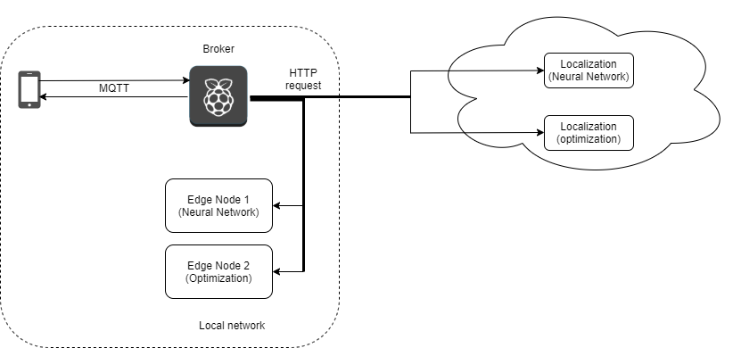

# device-localization

With the proliferation of Personal Mobile Devices (PMDs) over the last several years, the demand for localization applications has increased. These applications typically collect ranging values or timestamps from sensor devices near the user's PMD, and use these values to determine the user's position within a given space. The calculation used to perform localization is typically computationally expensive, and is often offloaded to a secondary device, which introduces further latency. 

The goal of this project is to reduce delay throughout the localization process by reducing two components of the latency:

1. The time required to communicate with the secondary device 
2. The time required for the localization computation 

The first component is explored by using an edge node near the PMD as the secondary computation location in order to reduce transmission delay. This is compared with using a remote EC2 instance in the AWS cloud. The second component is examined by switching from the conventional compute-intensive optimization algorithm for localization to a neural network machine learning model capable of predicting the localization result through regression.

A high level view of the architecture is shown below:

